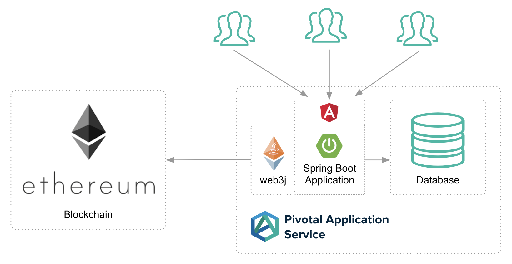

# Spring Boot Blockchain Sample

## High Level Overview



## Technologies

* Blockchain - Ethereum (Web3j)
* Backend - Spring Boot
* GUI - Angular 6
* Pull Request Model - Github
* CI CD - Concourse CI
* PaaS - Cloud Foundry

## Concourse deployment

### The pipeline


### Login to the concourse server

```
fly -t blockchain login -c https://concourse.blockchain.cf-demo.com
```

### Deploy the pipeline

```
fly -t blockchain set-pipeline -p spring-boot-sample-blockchain -c ci/spring-boot-sample-blockchain.yml -l ../../concourse/concourse.yml
```